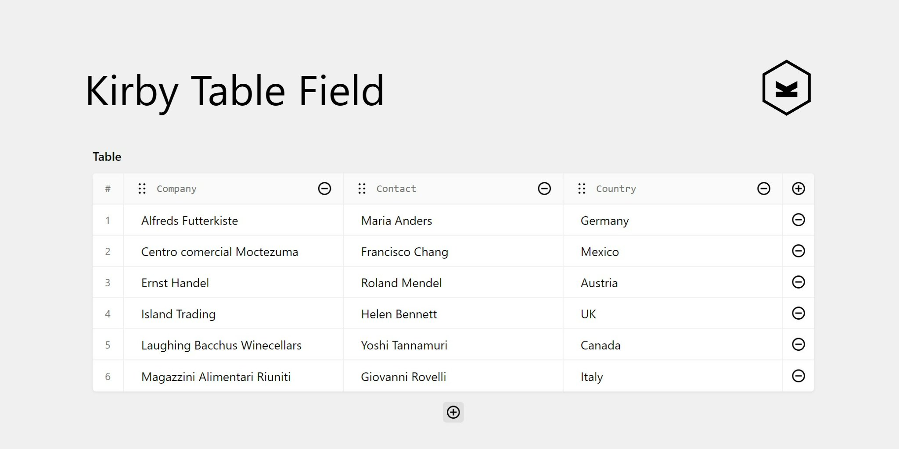

> [!NOTE]
> This flexible yet powerful panel field is designed to effortlessly manage and display large datasets. It enables users to dynamically add, edit, and organize data in rows and columns, offering intuitive controls for adding, removing, duplicating, and rearranging entries. Ideal for handling complex data structures while ensuring a clean and user-friendly interface.

## Installation

### Composer

```bash
composer require bogdancondorachi/kirby-table-field
```

### Git Submodule
```bash
git submodule add https://github.com/bogdancondorachi/kirby-table-field.git site/plugins/table-field
```

### Manual

[Download](https://api.github.com/repos/bogdancondorachi/kirby-table-field/zipball) and extract the folder to `/site/plugins/table-field`

## Field Usage

### Add the field to your blueprint:
```yaml
fields:
  table:
    label: Table
    type: table
    # optional (see field properties)
```

### Field Properties:
| Name       | Type            | Default | Description                                                      |
|:-----------|:----------------|:--------|:-----------------------------------------------------------------|
| align      | `string`        | `-`     | Set the text alignment of the table                              |
| disabled   | `bool`          | `-`     | If `true`, the field is no longer editable and will not be saved |
| duplicate  | `bool`          | `true`  | Toggles duplicating columns and rows in the table                |
| empty      | `string`        | `-`     | The placeholder text if no rows exists                           |
| help       | `string`        | `-`     | Optional help text below the field                               |
| index      | `int`, `bool`   | `1`     | Specifies the starting index. If set to `false`, it removes the index column; in this case, `sortable` would be disabled as well                                                                        |
| label      | `string`        | `-`     | Set the label above the field                                    |
| marks      | `bool`, `array` | `true`  | Set the allowed HTML formats. Activate/deactivate them all by passing `true`/`false`                                                                                                     |
| maxColumns | `int`           | `8`     | Set the maximum allowed columns in the table                     |
| minColumns | `int`           | `2`     | Set the minimum required columns in the table                    |
| sortable   | `bool`          | `true`  | Toggles drag & drop sorting                                      |
| translate  | `bool`          | `true`  | If `false`, the field will be disabled in non-default languages and cannot be translated. This is only relevant in multi-language setups.                                                                     |

### Use the field in your template:
```php
<?php
$table = $page->table()->toTable();
if (!empty($table['headers']) && !empty($table['rows'])): ?>
  <table>
    <thead>
      <tr>
        <?php foreach ($table['headers'] as $header): ?>
          <th><?= $header ?></th>
        <?php endforeach ?>
      </tr>
    </thead>
    <tbody>
      <?php foreach ($table['rows'] as $row): ?>
        <tr>
          <?php foreach ($row as $cell): ?>
            <td><?= $cell ?></td>
          <?php endforeach ?>
        </tr>
      <?php endforeach ?>
    </tbody>
  </table>
<?php endif ?>
```

## Blocks Usage

### Add the block to your blueprint:
```yaml
fields:
  text:
    type: blocks
    fieldsets:
      - table
```
### Overwrite default blueprint:
```yaml
name: Table
icon: table
preview: dataTable
fields:
  table:
    type: table
  caption:
    type: writer
    icon: text
    inline: true
```
To overwrite the default blueprint, place your custom file in `/site/blueprints/blocks/table.yml`

### Snippet:
```php
<?php
$table = $block->table()->toTable();
if (!empty($table['headers']) && !empty($table['rows'])): ?>
  <table>
    <thead>
      <tr>
        <?php foreach ($table['headers'] as $header): ?>
          <th><?= $header ?></th>
        <?php endforeach ?>
      </tr>
    </thead>
    <tbody>
      <?php foreach ($table['rows'] as $row): ?>
        <tr>
          <?php foreach ($row as $cell): ?>
            <td><?= $cell ?></td>
          <?php endforeach ?>
        </tr>
      <?php endforeach ?>
    </tbody>
  </table>
<?php endif ?>
```
To overwrite this default snippet, place your custom file in `/site/snippets/blocks/table.php`

## Buy me a coffee ☕

> [!NOTE]
> This plugin is provided free of charge & published under the permissive MIT License.  If you're using it for a commercial project or just want to help keep it alive, please consider [donating](https://github.com/sponsors/bogdancondorachi). Your support fuels future development!

## License

[MIT License](./LICENSE) Copyright © 2024 [Bogdan Condorachi](https://github.com/bogdancondorachi)
